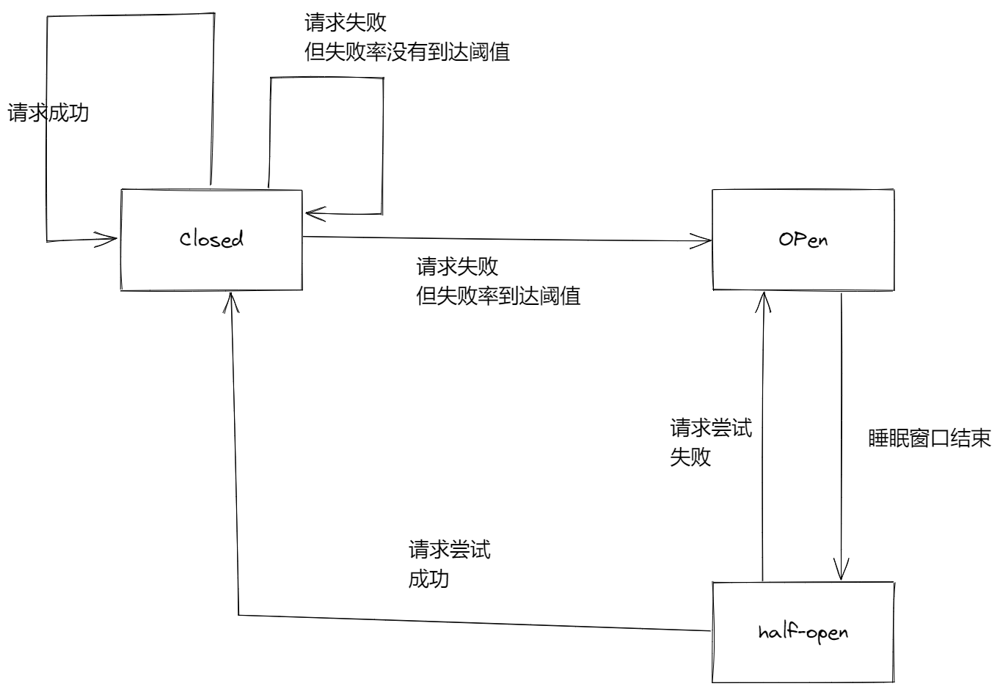

## 功能性需求
- 配置管理
- 服务发现与注册
- 熔断器
- 路由
- 微代理
- 事件总线
- 全局锁
- 决策竞选
- 分布式会话
- 全链路监控
- 服务网关
- 负载均衡

### 服务注册于发现
> - 服务注册是指，服务提供者将自己的服务信息告知服务注册中心
> - 服务发现是指，注册中心客户端组件从注册中心查询所有服务提供者信息，并且能告知注册中心客户端，其他服务的变化
> 从宏观角度来看，微服务架构下的系统角色可以简单分为`注册中心`、`服务提供者`、`远程客户端`

#### 主要功能：

##### 注册中心功能
- 服务注册表维护
- 服务健康检查

##### 服务提供者功能
- 服务注册
- 心跳续约
- 健康状态查询

##### 注册中心客户端功能
- 服务发现
- 实例缓存

说明：
- 远程客户端于服务提供者之间一般使用某种`RPC通信机制`来进行服务消费，常见的方式为REST API\(底层基于[HTTP](/Web/extend/agreement/HTTP.md)\)

### 微服务调用
> 远程接口访问的RPC框架

主要功能
- 序列化
- 反序列化
- 网络框架
- 连接池
- 收发线程
- 超时处理
- 状态机

### 负载均衡
> 用于均衡调度多个实例

#### 服务端负载均衡
> 在消费者和服务提供者中间使用`独立的反向代理服务器`进行负载均衡

说明：
1. 可以通过硬件方式，如F5设备
2. 可以通过软件方式，如[Nginx](../Nginx/Nginx.md)
3. 一般都是两者结合，组成多层级代理

#### 客户端负载均衡
> 客户端自己维护一份从注册中心获取的Provider清单，根据自己配置的`负载均衡算法`选择客户端进行请求

#### 熔断器
> 解决雪崩效应，将一些非核心分服务进行服务降级

##### 雪崩效应
> 由于基础依赖，而导致的整个链路的失效

常见原因：
1. 硬件故障
2. 流量激增
3. 缓存穿透
4. 程序BUG
5. JVM卡顿

##### 工作机制
> 统计最近RPC调用发生错误的次数，根据统计信息中的`失败比例`等信息，判断是否允许后面的RPC调用`继续或者快速失败`

##### 状态
- 关闭
  > 初始状态，RPC调用正常放行
- 开启
  > 失败比例达到阈值，RPC调用会快速失败，然后执行失败回退逻辑
- 半开启
  > 当开启一段时间后（一般为睡眠窗口结束），开始对`小流量`进行`尝试放行`，根据放行结果，决定时继续开启，还是关闭
  

