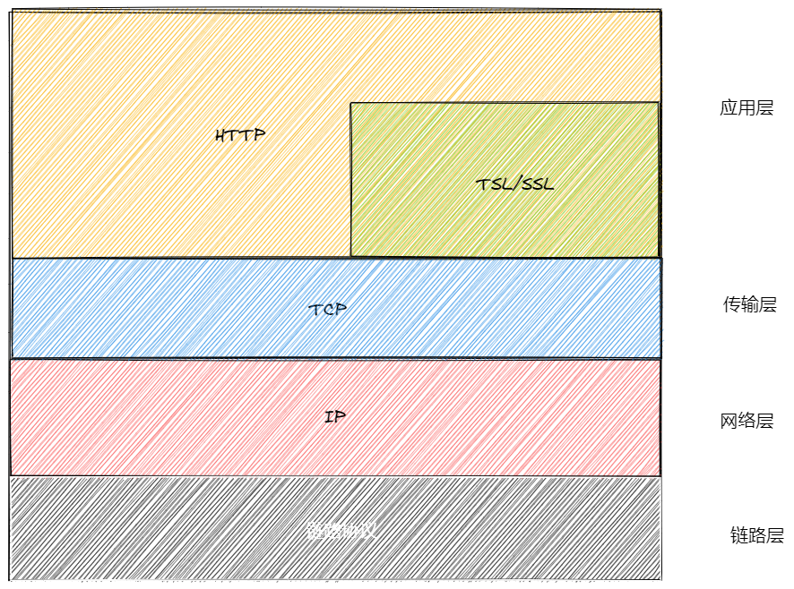

# Web服务器机制

## 通信协议

### [HTTP](../extend/HTTP.md)/[HTTPS](../extend/HTTPS.md)

#### 概述
HTTP
- 是用户wen服务器传输超文本到本地浏览器的协议
- 我们普遍使用的版本是`HTTP1.1`
- 是一个`应用层`协议
- 是一个`无状态`的协议，即在`同一个客户端`上，此次请求于上一次请求没有`对应关系`
- HTTP可以直接机内`TCP`传输层
- 一般端口号为80

HTTPS
- 本质上也是`HTTP协议`
- 在`HTTP`的基础上增加了一个[SSL/TLS](../extend/SSL-TLS.md)协议层
- HTTPS先经过SSL/TLS再进入TCP传输层
- 一般端口号为443

## 套接字通信

