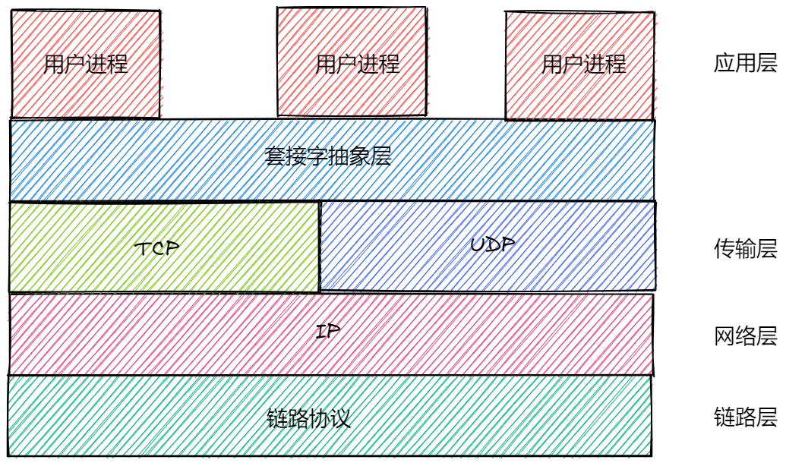

# Web服务器机制

## 通信协议

### [HTTP](../extend/agreement/HTTP.md)/[HTTPS](../extend/agreement/HTTPS.md)

#### 概述
HTTP
- 是用户wen服务器传输超文本到本地浏览器的协议
- 我们普遍使用的版本是`HTTP1.1`
- 是一个`应用层`协议
- 是一个`无状态`的协议，即在`同一个客户端`上，此次请求于上一次请求没有`对应关系`
- HTTP可以直接机内`TCP`传输层
- 一般端口号为80

HTTPS
- 本质上也是`HTTP协议`
- 在`HTTP`的基础上增加了一个[SSL/TLS](../extend/agreement/SSL-TLS.md)协议层
- HTTPS先经过SSL/TLS再进入TCP传输层
- 一般端口号为443

## 套接字通信
> - 应用层与[TCP/IP协议簇](../extend/agreement/TCP-IP.md)通信的`中间抽象层`,是一组接口
> - 应用层通过调用这些接口来进行发送和接受数据
> - 一般这种抽象由`操作系统`提供或者`JVM`自己实现

### 类型
#### TCP/IP协议簇中的类型
> 一个TCP/IP套接字，由一个互联网地址，一个协议及一个端口号的`唯一`确定
- TCP协议，流套接字
- UDP协议，数据报套接字

### 通信方式

#### 单播通信
> - `单个网络节点`与`单个网络节点`之间的通信
> - 一种一对一模式，发送和接受信息旨在两者之间进行
> - Java中提供`ServerSocket`

#### 组播通信
> - 一种一对多模式
> - 需要向`路由器或者交换机`申请加入某组织，`路由器交换机`在收到消息后，会向所有成员发送消息
> - 核心问题在于如何维护路由器与主机之间的关系，只要通过[IGMP](../extend/agreement/IGMP.md)协议进行维护
> - 可以在`公网传播`
> - Java中提供`MulticastSocket`
注：
> 1. Tomcat的默认[组播地址](../extend/agreement/TCP-IP.md)是228.0.0.4

特点
- 节约网络资源
- 由针对性地向组内成员传播
- 可以在互联网上进行传播
- 没有可靠地传输协议，会导致数据不可靠

#### 广播通信
> - 一种一对多模式
> - 会向路由器连接的`所有主机`都发送消息
> - 会浪费网络资源，但是不需要维护路由器与主机之间的成员关系
> - 只能在`局域网中传播`
> - Java中提供`DatagramSocket`

## 服务器模型
> 这里主要是指服务器端对I/O的处理模型

### 单线程阻塞I/O模型
> - 只能同时处理`一个客户端`访问，并且在I/O操作上是`阻塞的`。
> - 客户端连接与服务器处理线程比例`n:1`

特点
- 最简单的模型
- 整个运行过程只有一个线程
- 服务器系统资源消耗小
- 并发能力低
- 容错能力差

### 多线程阻塞I/O模型
> - 利用多线程机制，为`每个客户端`分配`一个线程`
> - 客户端连接与服务器处理线程比例`1:1`

特点
- 支持多个客户端并发响应
- 处理能力较高
- 并发能力较好
- 对服务器资源消耗较大
- 多线程之间会产生线程切换成本
- 结构相对复杂

### 单线程非阻塞I/O模型
> - 在调用读取或者写入接口后`立即返回`，从而不会进入阻塞状态
> - 利用了套接字的事件检测机制

### 扩展
#### 套接字事件的检测机制
检测方法
- 应用程序便利套接字的事件检测
> - 应用层线程对套接字列表`轮询尝试`读取和写入
> - 一般不适合实际使用,使用`事件驱动`的非阻塞方式更优
- 内核便利套接字的事件检测
> - 操作系统内核把套接字遍历的结果组织成一些列的`事件列表`并返回给应用层
> - 可以提高检测效率
> - 如果套接字连接数量过大，内核复制列表的开销也会很大
> - 在`活跃连接较少`的时候，内核与应用层之间存在很`多无效的数据副本`,
> - 内核会讲`活跃的`和`不活跃的`连接状态都复制到应用层
- 内核基于回调的事件检测
>