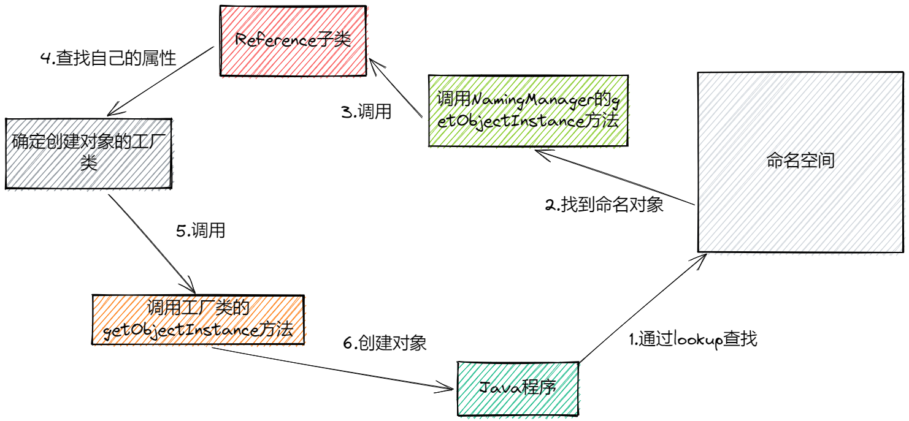
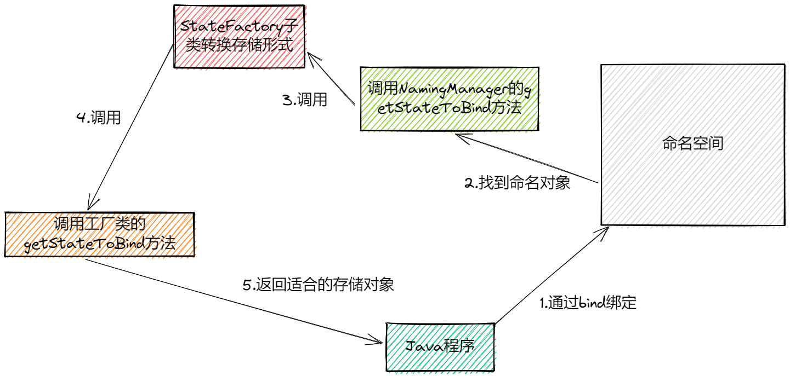

> 一般的JEE或者Web服务器都会实现对[JNDI](/java/Standard/JNDI.md)的支持

## Tomcat中的JNDI

### 前置条件
> 一般接入JNIDI需要和初始上下文、对象工厂、状态工厂打交道

#### 初始上下文
> 负责封装JNDI连接底层服务提供者的默认策略

特点：
- 是访问命名服务的入口
- 根据特定策略指定一个上下文工厂类并生成一个`上下文`
	- 支持URL格式访问命名空间
	- 根据实际需要，可以覆盖默认策略
	- 需要扩展初始上下文，支持自定义上下文接口

#### 对象工厂
> 定制使用保定信息创建命名对象的策略

特点：
- 为命名上下文存储形式（绑定信息）转化成对象提供机制策略
- 通过环境变量`java.naming.factory.object`确定对象工厂位置
- 如果没有指定对象的工厂，则不会对对象进行处理

#### 状态工厂
> 定制命名对象生成绑定信息的策略

特点：
- 为对象转换成适合命名上下文实现存储的形式（绑定信息）提供机制策略
- 通过环境变量`java.naming.factory.state`确定对象工厂位置
- 如果没有指定状态的工厂，则不会对对象进行处理

### 实现方式
> 看一下Tomcat里面的JNDI是如何实现的

说明：
1. 由于资源绑定方式的不同（类加载器绑定 ），导致全局资源和局部资源他们的可见范围不一样

### 使用方式
>需要考虑全局和局部两种形势，全局命名资源是对Web应用是不可见的，如果需要使用，那么久需要配置`ResourceLink`从全局资源中查找，局部资源只能给当前的Web程序使用

步骤：
1. 驱动器Jar包防止
2. 配置文件的配置
3. 在程序中调用

### 标准资源
- 普通的JavaBean资源
- UserDataBase资源
- JavaMail会话资源
- JDBC数据源资源