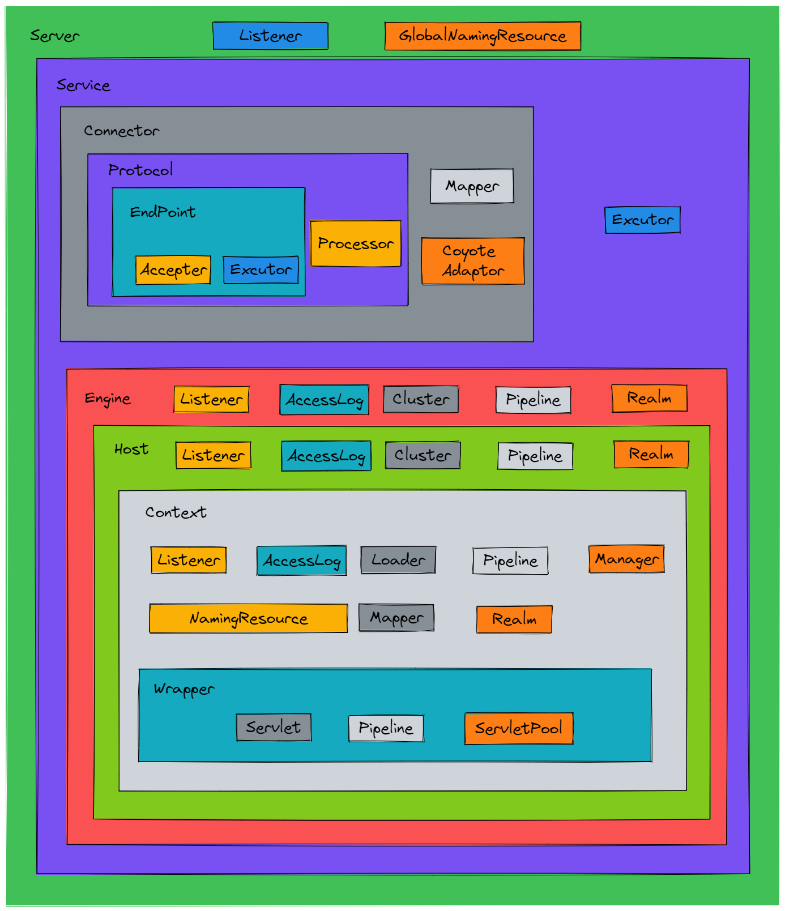

> 从高度抽象的角度来讲，Tomcat可以看成时由连接器（Connector）和容器（Container）组成

### 概要介绍

#### [Server组件](./assembly/Server.md)
> - 代表整个Tomcat实例，在一个JVM中只会包含一个
> - 为了方便扩展，引入了监听器方式
> - 为了方便在Tomcat中继承`JNDI`，引入了`GlobalNamingResource`
> - 可以包含多个`Service组件`

#### [Service组件](./assembly/Service.md)
> - 是个服务的抽象
> - 不同的`Connetor组件`使用不同的通信协议
> - 可以包含多个`Connetor组件`和一个处理请求的`Engine组件`
> - 包含一个`Executor组件`,即一个`线程池`，为Service内所有的组件提供线程池执行任务

#### [Connector](./assembly/Connector.md)组件
> - 主要职责就是接收客户端连接并接收消息报文
> - 报文消息经过器解析后，传入容器组处理

组件组成情况
- 阻塞I/O
> - `Http11Protocol组件`，处理报文消息
> 	- `JioEndpoint组件`
> 		- `Acceptor组件`，监听端口
> 		- `Executor组件`，处理请求
> 	- `Http11Processor组件`，将报文消息传递给`Engine容器`继续处理
> - `Mapper组件`，路由导航，寻找合适的`Servlet`
> - `CoyoteAdaptor组件`，Connetor和Container的适配器
- 非阻塞I/O
> - `Http11NioProtocol组件`，处理报文消息
> 	- `NioEndpoint组件`
> 		- `Acceptor组件`，监听端口
> 		- `Executor组件`，处理请求
> 		- `Poller组件`，轮询多个客户端连接，不断检测、处理各种事件
> 	- `Http11Processor组件`，将报文消息传递给`Engine容器`继续处理
> - `Mapper组件`，路由导航，寻找合适的`Servlet`
> - `CoyoteAdaptor组件`，Connetor和Container的适配器

#### [Engine](./assembly/Engine.md)组件
> - 代表全局的Servlet引擎
> - 每个`Service组件`只能包含一个
> - 可以包含若干个`Host容器`

组件构成
- Listener，在Tomcat生命周期中完成某些`Engine组件`相关工作的监听器
- AccessLog，客户端的访问日志
- Cluster，提供集群功能
- Pipline，对请求进行处理的通道
- Realm，`Engine容器`级别的用户-密码-权限的数据对象，配合资源认证模块使用

#### [Host](./assembly/Host.md)组件
> - 代表虚拟主机
> - 可以放多个`Context容器`

组件构成
- Listener，在Tomcat生命周期中完成某些`Host组件`相关工作的监听器
- AccessLog，客户端的访问日志
- Cluster，提供集群功能
- Pipline，对请求进行处理的通道
- Realm，`Host容器`级别的用户-密码-权限的数据对象，配合资源认证模块使用

#### [Context](./assembly/Context.md)组件
> - 代表Web应用
> - 包含了各种静态资源，各种动态资源
> - 可以包含多个`Wrapper容器`

组件构成
- Listener，在Tomcat生命周期中完成某些`Context组件`相关工作的监听器
- AccessLog，客户端的访问日志
- Pipline，对请求进行处理的通道
- Realm，`Context容器`级别的用户-密码-权限的数据对象，配合资源认证模块使用
- Loader，加载Web应用的资源，保证不同的Web应用之间的资源隔离
- Manager，管理对应Web应用的会话，包括生成、更新和销毁
- NamingResource，将Tomcat的`server.xml`和Web应用的`context.xml`资源和属性映射到内存中
- Mapper，当前Context容器的路由导航

#### [Wrapper](./assembly/Wrapper.md)组件
> - 代表的是Servlet
> - 于Servlet一对一

组件构成
- Servlet，我们日常开发的Servlet
- ServletPool，Servlet实现了`SingleThreadModel`时才会产生的Servlet对象池
- Pipeline，请求处理通道

## Next [生命周期管理](./LifeCycle.md)