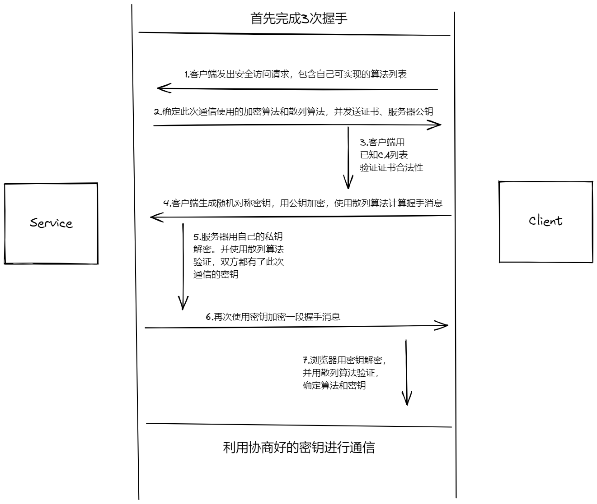

## 工作原理
> 基于[TCP/IP](./TCP-IP.md)协议通信的，属于`可靠传输`，所以必须先进行`三次握手`，完成连接后，在进行`SSL`的握手协议。

## 说明
1. 客户端浏览器向服务器发送`SSL/TSL`协议的版本号，[加密算法](./encryption.md)的种类，产生的`随机数`，以及其他需要的各种信息
2. 服务端从客户端支持的`加密算法`中选择一组加密算法和Hash算法，并且把自己的`证书`(包含网站地址、加密公钥、证书办法机构等)发送给客户端
3. 浏览器获取服务器证书后，验证其合法性，验证颁发机构是否合法，验证证书中改的网址是否与正在访问的地址一致
4. 客户端浏览器生成一串随机数并用服务器传来的公钥加密，在使用约定好的Hash算法计算握手消息，发送到服务端
5. 服务器受到握手消息后，用自己的私钥解密，并使用`散列算法验证`，这样就获得了此次通信的密钥
6. 服务端在使用密钥加密一段握手消息，返回给客户端浏览器
7. 浏览器用密钥解密，并用散列算法验证，确定算法与密钥